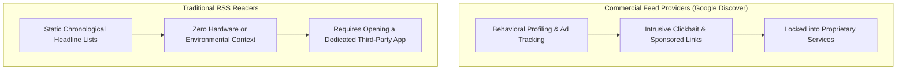
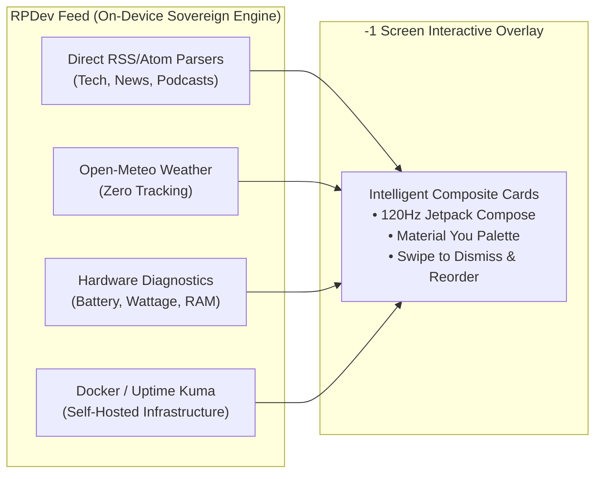

# 🌟 The Evolution of RSS: From Flat Lists to Intelligent Dashboards

For over two decades, RSS (Really Simple Syndication) has been the cornerstone of the decentralized web. However, modern users often abandon RSS readers for social media streams and algorithmic news feeds like Google Discover.

Why? Because traditional RSS readers are **flat, static, and isolated**.

---

## The Problem with Traditional News & Feeds

---

## The RPDev Feed Solution: A Living Contextual Stream

RPDev Feed fundamentally reinvents the minus-one desktop experience:

### 1. Zero-Proxy RSS Ingestion
Most modern "smart readers" route your feed URLs through their cloud servers to parse headlines, creating a detailed surveillance profile of your reading interests. RPDev Feed fetches and parses XML/RSS feeds **directly on your Android device**. No third party ever sees what feeds you subscribe to.

### 2. Contextual Fusion
Why should weather, hardware diagnostics, and your morning news live in separate apps? RPDev Feed arranges your day into a unified hierarchy:
- **Header**: Privacy Weather radar for your city.
- **Diagnostics**: Real-time battery charging wattage and memory headroom.
- **Top Stories**: Filtered, clean headlines from your trusted independent publications.
- **Alerts**: Keywords detected by your [Web Scraper](https://repo.launcher.iamrp.dev/catalog/modules/web-scraper) or failed container health checks from your [Docker Monitor](https://repo.launcher.iamrp.dev/catalog/modules/docker-telemetry).

### 3. Freedom of Choice
You can toggle any module off, adjust its polling frequency, or install third-party plugins from [repo.launcher.iamrp.dev](https://repo.launcher.iamrp.dev) in seconds.
